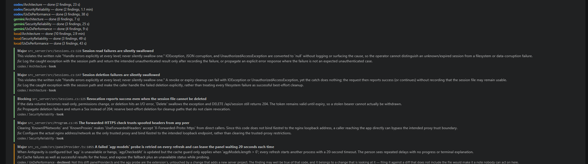

# Oleksandr Dubyna

*Jinx was here.*

Systems architect. I build the tooling that makes AI coding agents safe to let loose: a review gate run by
**other vendors'** models, a credential broker that never hands over a credential, retrieval engines that
ship with their measurements. .NET 10 Native AOT, Rust, TypeScript. Spain.

## What I ship

### [ConnectOtherAIs](https://github.com/oleksandrdubyna88/dew_flow_connect_other_ais) — a review gate run by other vendors' models

`code --install-extension remsoftdev.connect-other-ais`

Your AI cannot see its own assumptions. Other vendors' models can. So before the code is written, Codex,
Antigravity (Gemini), a second Claude or DeepSeek read the **plan** — and after it is written they read the
**diff** — in rounds, until the findings that matter drop under a threshold or a human is called. In
[the repo's own words](https://github.com/oleksandrdubyna88/dew_flow_connect_other_ais/blob/main/README.md):
*"The value is not 'more review'. It is review by a model that cannot see the author's reasoning."*

- A Native-AOT .NET 10 MCP server over stdio. The extension is the face; the engine is a process your MCP
  client starts.
- The plan is gated **before** the code exists: `review_code` refuses until a plan round reached `proceed`.
  *Skipped stages are impossible, not discouraged.*
- Findings de-duplicated — same file, lines within ±5, same remark → one — and gated per role. Every accept
  and every reject, with its reason, is kept locally: the shape of your own AI's blind spots.
- A model on your own machine, over Ollama or vLLM, can sit in the same chair. It is measured per stage and
  told where it earns its place.

**Measured — one commit, three hosted models, 19 findings, each judged by reading the code it cites:**
taking the repository checkout away made every model find *more* useful defects — 4→8, 6→10, 6→7 — at a
half to a third of the input tokens, with no wrong finding from any of them
([the raw table](https://github.com/oleksandrdubyna88/dew_flow_connect_other_ais/blob/main/research/RESULTS_findings_that_are_worth_something.md)).
The gate also reviewed itself and found nine real defects. All fixed; every fix watched fail first.

### [CredsForDevs](https://github.com/oleksandrdubyna88/dew_flow_creds_for_devs) — a credential broker that never hands over a credential

`code --install-extension remsoftdev.creds-for-devs`

SSH hosts, keys, VPN configs, database connections and passwords, in VS Code — with an optional self-hosted
server so a team can share them without anyone running a vault they have to trust. The one idea worth
knowing, [in the repo's words](https://github.com/oleksandrdubyna88/dew_flow_creds_for_devs/blob/main/README.md):
**"The server cannot read anything it stores."**

- Secrets live in the OS keychain. What syncs is AES-256-GCM under a random 256-bit master key; scrypt
  (N = 2¹⁷) only ever wraps the PIN —
  [cryptoUtils.ts](https://github.com/oleksandrdubyna88/dew_flow_creds_for_devs/blob/main/src_vs_code/src/cryptoUtils.ts).
  The server holds ciphertext and has no code path that could acquire a key.
- An AI agent gets a **capability token, never a credential**. The broker's response protocol has no field
  a secret could occupy —
  [brokerProtocol.ts](https://github.com/oleksandrdubyna88/dew_flow_creds_for_devs/blob/main/src_vs_code/src/brokerProtocol.ts)
  says so in its first ten lines, and the compiler holds it to that. Every single call still asks you, in
  your editor, showing the real entry and the real command.
- Agent access is a six-switch ladder, off by default, in which "may edit but not view" is unrepresentable —
  [mcpAccess.ts](https://github.com/oleksandrdubyna88/dew_flow_creds_for_devs/blob/main/src_vs_code/src/mcpAccess.ts).
- Zero runtime dependencies in the extension. A YAML/TOML/INI validator, a Shamir split, an SSH agent and a
  QR decoder each had an obvious package and
  [were written instead](https://github.com/oleksandrdubyna88/dew_flow_creds_for_devs/blob/main/research/module_extension.md).
- Sizes, stated honestly: the Native-AOT `creds` CLI is **6.8 MB on disk, 2.3–3.1 MB to download**; the
  server image is **50 MB**, chiseled, no shell.

Security reviews are dated and public. The one from
[2026-08-27](https://github.com/oleksandrdubyna88/dew_flow_creds_for_devs/blob/main/research/SECURITY_REVIEW_2026-08-27.md)
found a HIGH — output masking keyed on field *names*, so a renamed field could echo a freshly rotated
password back to the agent — and fixed it the same day, red test first.

## How I work

- **Zero leaks by construction.** A protocol with no field for a secret beats a policy that asks a model not
  to leak one. The compiler does not get tired.
- **Native AOT, because startup is the user-visible cost.** An MCP client waits for the handshake before it
  can list a single tool. If a CLI needs a 200 MB runtime to bridge IPC, the architecture failed.
- **Every number ships with its sample size — including the ones that refuted me.** A measurement that
  cannot change a setting is decoration.

## Measured, not assumed

The numbers I trust are the ones that argued with me. Each row below refuted an intuition, and each links
to the public file holding the raw data.

| I assumed | The measurement said |
|---|---|
| A narrower sweep finds the best setting | Reranker pool **20 beat 50** on a 50-task grid (32 vs 29 matched). The full set — 64 tasks, 182 expectations — **reversed it, 88 vs 80**. A sweep manufactures winners. — [MEASURED_LESSONS.md](https://github.com/oleksandrdubyna88/dew_flow_benchmark/blob/main/research/MEASURED_LESSONS.md) |
| More tools beat better wording | Rewriting **one** instruction about which tool to use moved a score **16.5 of 63**; swapping the toolbox from 4 tools to 18 moved it **1**. — [architecture.md](https://github.com/oleksandrdubyna88/dew_flow_mcp/blob/main/research/architecture.md) |
| The wire is free | The same four tools scored **4 of 63 over MCP** against **36 of 63 in-process**, replicated at sixteen tools as 4/47 vs 11/47. Surface *shape* moved the score 9×. — [architecture.md](https://github.com/oleksandrdubyna88/dew_flow_benchmark/blob/main/research/architecture.md) |
| A model can grade its own homework | Two arbiters, the same six answers: the independent one passed **0 of 6**; the one that was also the subject passed **6 of 6**. — [MEASURED_LESSONS.md](https://github.com/oleksandrdubyna88/dew_flow_benchmark/blob/main/research/MEASURED_LESSONS.md) |
| Cosine 1.0 means identical bytes | On an R9700 through DirectML: cosine **1.000000000**, and yet **1012 of 1024 elements differ**, max delta 2.868e-07. — [README.md](https://github.com/oleksandrdubyna88/dew_flow_sidecar_rust/blob/main/README.md) |
| A smaller result limit is a free saving | Dropping it from 20 to 5 lost **29 %** of the ground truth while r@1 and r@3 stayed identical — invisible in any single call. — [README.md](https://github.com/oleksandrdubyna88/dew_flow_mcp/blob/main/README.md) |

## Also public

- **[dew_flow_sidecar_rust](https://github.com/oleksandrdubyna88/dew_flow_sidecar_rust)** — a single-binary
  Rust embedding + reranking service: BGE-M3 dense and sparse in one forward pass, bge-reranker-v2-m3, on
  whatever GPU is present — DirectML, CUDA, MIGraphX/ROCm or CPU as compile-time features. A wedge detector
  for the forward pass ONNX Runtime cannot cancel; a cosine canary gating every freshly compiled engine,
  because a crash mid-compile leaves a cache that loads fine and answers wrong.
- **[dew_flow_benchmark](https://github.com/oleksandrdubyna88/dew_flow_benchmark)** — *measure any code
  repository, at any commit, through any retrieval engine — and get an answer that survives being asked ten
  thousand times.* A selection/held-out split in the contract itself, and one wall-clock budget per leg,
  because a per-call timeout under a 25-turn agent loop is four hours of one leg.
- **[dew_flow_mcp](https://github.com/oleksandrdubyna88/dew_flow_mcp)** — one tool catalog over stdio and
  HTTP/SSE, plus a bridge that hands the same tools to a local LLM in-process. The public repo cannot know
  retrieval exists — architecture tests on **both** sides of the boundary enforce it. Tool descriptions are
  runtime configuration, because wording turned out to be the biggest lever in the system (see above).
- **[dew_flow_conventions](https://github.com/oleksandrdubyna88/dew_flow_conventions)** — one copy of every
  cross-repository rule for AI-agent sessions, mounted as a git submodule in five repositories; CI fails
  when a consumer's pin is behind. Written after an audit found three consumers two commits behind and one
  missing a rule entirely.
- **dew_flow_rag_qln** `[private]` — the retrieval product behind all of the above: a .NET 10 daemon
  indexing C# repositories into Postgres + Qdrant + Neo4j, RRF or weighted fusion, a cross-encoder rerank.
  Indexed `dotnet/aspnetcore`: **10,813 files, 52,545 members, 76,137 points, 16,223 types / 59,401 edges**
  — a full pass in 18 min 39 s; a repeat pass with nothing changed in 1 min 24 s, 0 written. The repository
  is not public; the numbers are from its architecture record.

## Recent releases

<!-- releases:start -->
- [dew_flow_connect_other_ais · extension-v0.30.4](https://github.com/oleksandrdubyna88/dew_flow_connect_other_ais/releases/tag/extension-v0.30.4) — 2026-09-06
- [dew_flow_creds_for_devs · extension-v1.0.0](https://github.com/oleksandrdubyna88/dew_flow_creds_for_devs/releases/tag/extension-v1.0.0) — 2026-09-06
- [dew_flow_connect_other_ais · mcp-v0.18.1](https://github.com/oleksandrdubyna88/dew_flow_connect_other_ais/releases/tag/mcp-v0.18.1) — 2026-09-05
- [dew_flow_connect_other_ais · extension-v0.30.3](https://github.com/oleksandrdubyna88/dew_flow_connect_other_ais/releases/tag/extension-v0.30.3) — 2026-09-05
- [dew_flow_creds_for_devs · extension-v0.99.1](https://github.com/oleksandrdubyna88/dew_flow_creds_for_devs/releases/tag/extension-v0.99.1) — 2026-09-05
- [dew_flow_creds_for_devs · extension-v0.99.0](https://github.com/oleksandrdubyna88/dew_flow_creds_for_devs/releases/tag/extension-v0.99.0) — 2026-09-05
- [dew_flow_connect_other_ais · extension-v0.30.0](https://github.com/oleksandrdubyna88/dew_flow_connect_other_ais/releases/tag/extension-v0.30.0) — 2026-09-05
- [dew_flow_connect_other_ais · mcp-v0.18.0](https://github.com/oleksandrdubyna88/dew_flow_connect_other_ais/releases/tag/mcp-v0.18.0) — 2026-09-05
<!-- releases:end -->

The eight newest across the public repositories; the full list is in [releases.md](releases.md).
Refreshed daily by [a workflow in this repo](.github/workflows/update-releases.yml) — bot-authored, and
silent on days nothing shipped.

## Reach me

Install them, break them, tell me what you found. Or hire me to build the next one.

**oleksandrdubyna88@gmail.com** · Telegram **[@sashnetdev](https://t.me/sashnetdev)** · Spain
